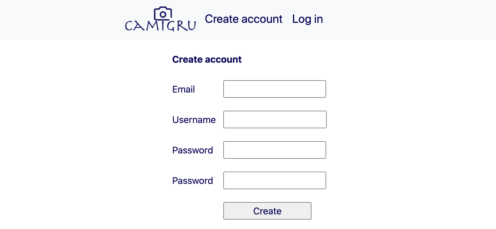
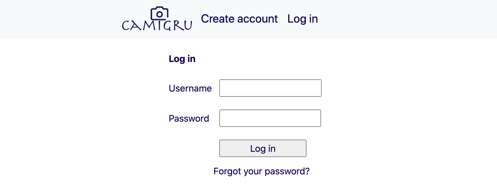
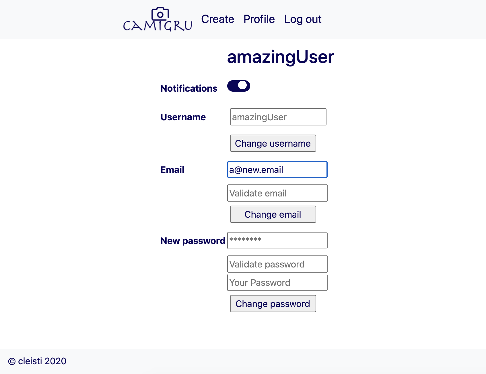
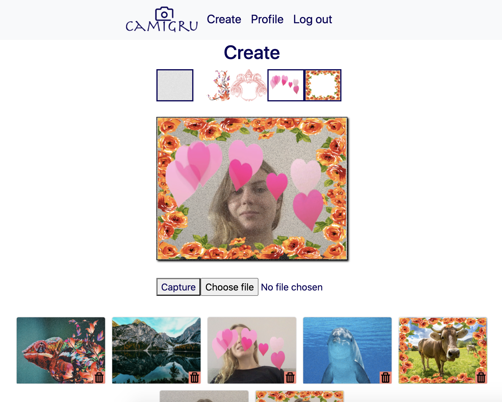
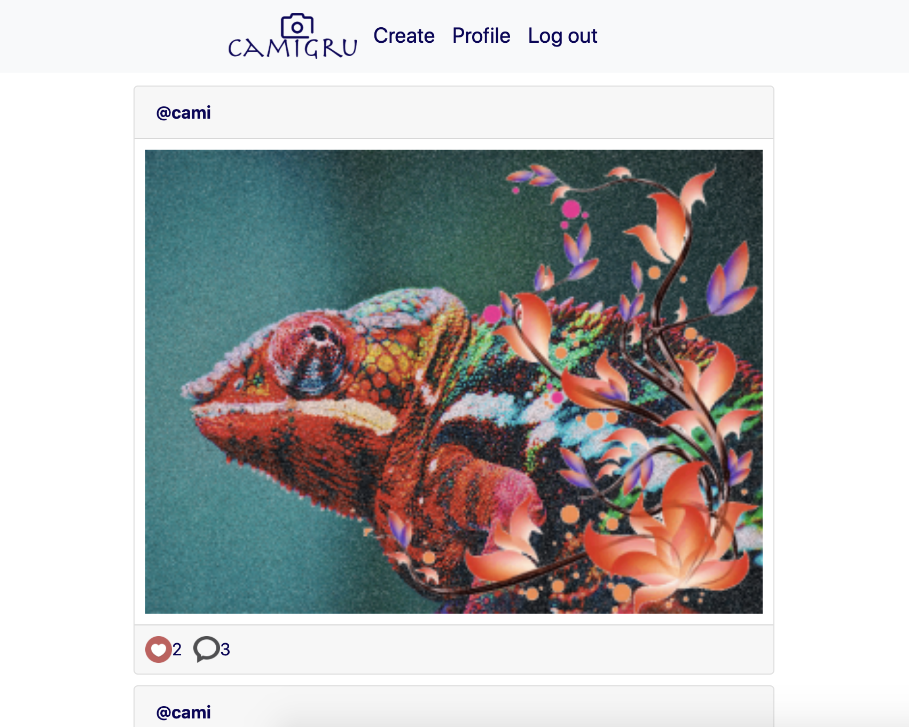
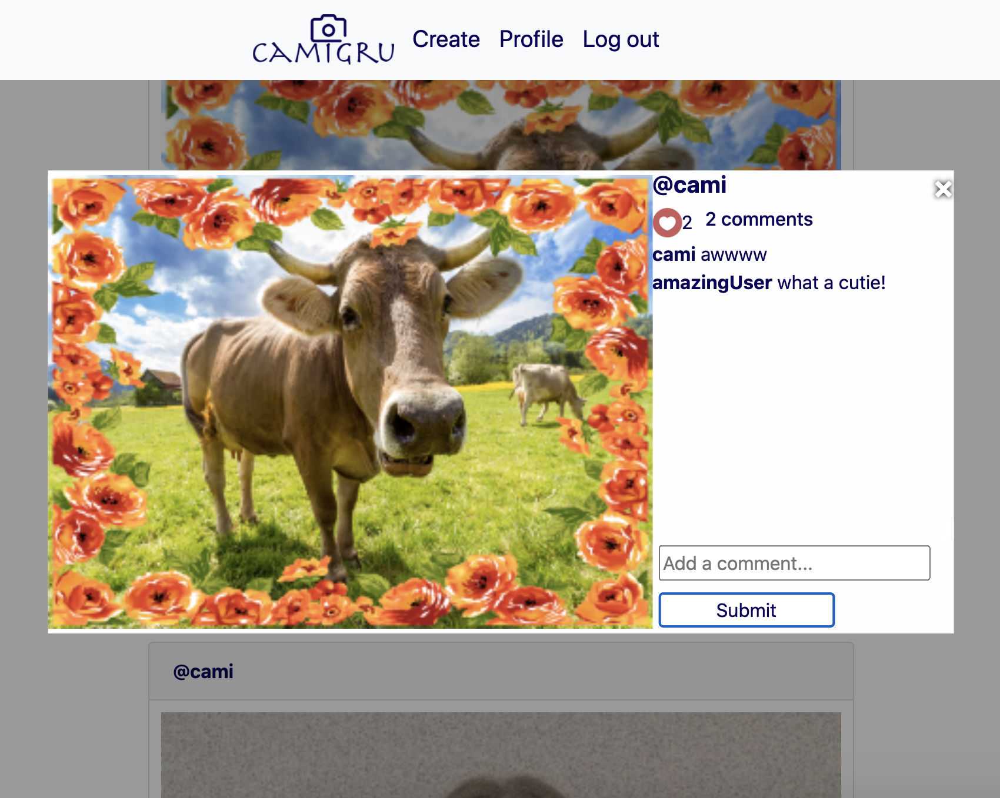

# camigru :camera_flash:

## An instagram/snapchat like web-app

The idea with the project was to learn the basics of creating a web-app for which users can sign up, upload and create content and modify their own settings. Languages allowed for the project were
- HTML
- CSS (frameworks without JS allowed)
- Vanilla Javascript for frontend
- PHP for backend
- MySQL as database service

The subject suggested to structure the app as an MVC-application, which I unfortunately missed. This project is built completely with a creative structure, and as I learned a lot during the project, the ways in which I handle requests differs somewhat in different parts.

Some comments that I got for possible <u>improvement</u> were
- to use foreign keys in the database
- variables for server URLs
- adding some demo users with seed data right att setup

What I would myself do differently, would be to build the application with a MVC-structure. Also choose some nicer filters to begin with.

I didn't put on much work on the layout of the project, most of the CSS is bootstrap, with of course some tailored additions. I did use a blue color theme throughtout the app, created a simple logo and a favicon to make it look nice. As you can see, I also took the freedom to change the name to Camigru, for unknown reasons :stuck_out_tongue_winking_eye: 

A user must be able to sign up by adding a valid email, username and a password with a minimum level of complexity. The user must verify the account through a unique link sent to the email.

Only after verification can the user log in. Also in case of a forgotten password, the user must be able to send a password-reinitialisation link to their email.

On the profile section, the user must be able to modify the username, email-adress and password, as well as the setting to receive notifications to the email address when a new comment is received on an image.

On the creation page, the user must be able to take pictures with their webcam, add one or more filters and save the image. They also need to be able to upload an image if they, for example don't have a webcam. The superposing of the images is done completely server-side, in PHP. On this page, the user is also able to delete their own images.

On the gallery page, all images by all users are shown, in a descending order by creation. Logged in users are able to like and comment on the images.

When clicking on the image or the comment icon, a lightbox will open up, showing the comment field and all the comments on the image. If a user is logged in, they will be able to submit a comment here.
